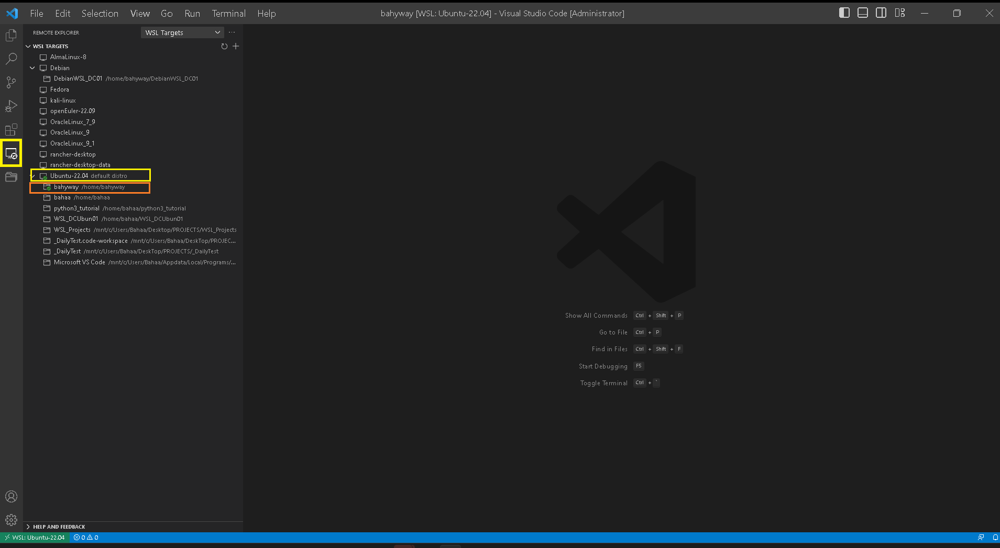
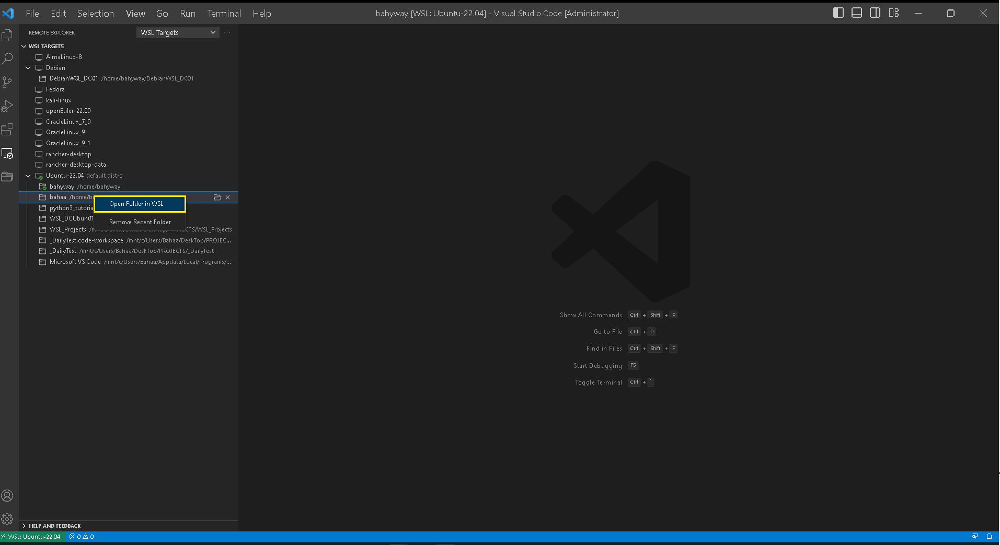
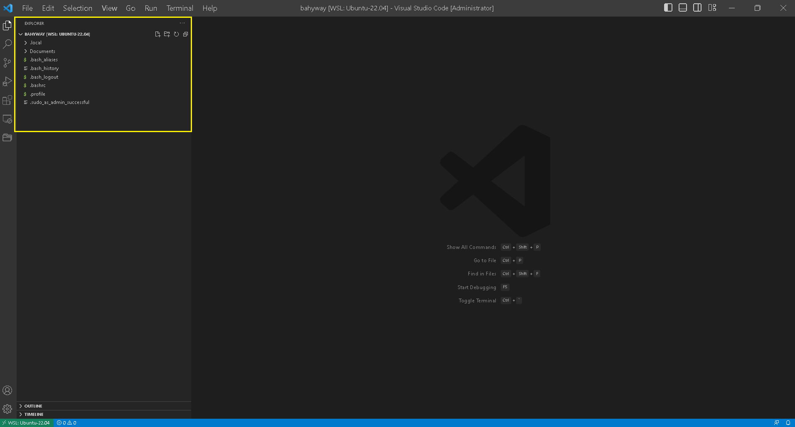

# 1. VSCode working with WSL Ubuntu22.04

### Step By Step

1. After Creating GitHub Repository <mark style="color:green;">**DevAnsibleSQLServerLAB**</mark> , and clone it to the local filesystem, open it with VSCode.
2. In VSCode install a <mark style="color:blue;">**Remote-WSL**</mark> extension, or any extension works with WSL.
3.  Press `Ctrl + Shift + P` (or `Cmd + Shift + P` on macOS) to open the command palette.

    Type "**Remote-WSL: New WSL Window**" in the command palette and select it.
4. Open the WSL in VSCode as in the following screenshot ,and select the user you create to work with :

<figure><figcaption>
select bahyway as a user
</figcaption></figure>

4. right-click on the folder and select <mark style="color:blue;">**Open Folder in WSL**</mark>

<figure><figcaption>
Open Folder in WSL
</figcaption></figure>

5. This Will Open <mark style="color:blue;">**bahyway**</mark> User home folder in WSL Ubuntu22.04 , where you can create your solution in.

<figure><figcaption></figcaption></figure>
